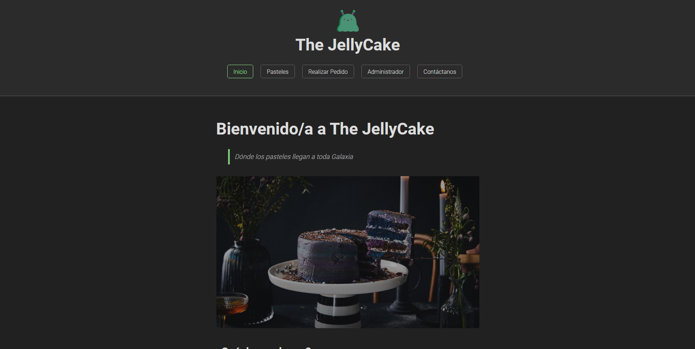
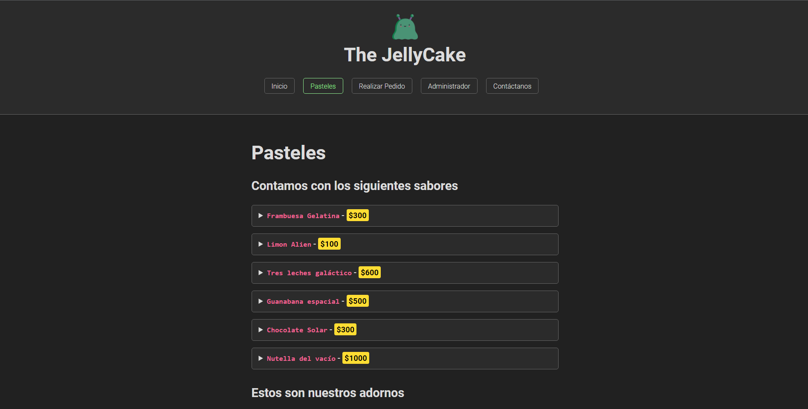
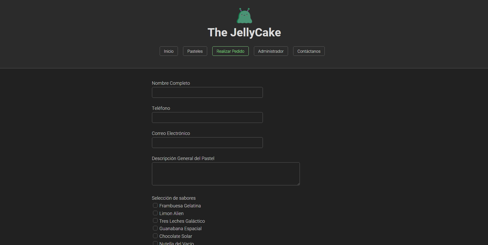
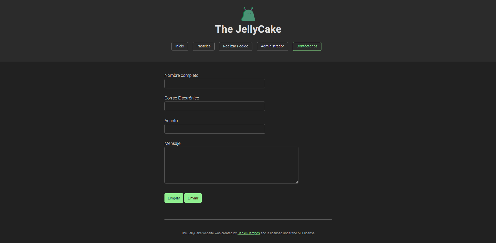
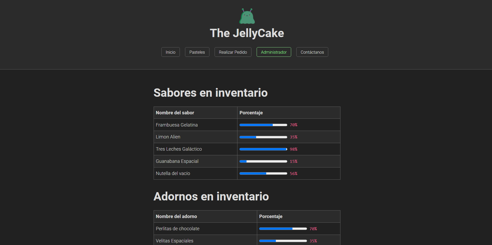

# Prácticas de Intro a HTML
**Katas correspondientes a la semana 2 del curso de FrontEnd de Launch X - Innovacción Virtual**

Para la práctica de esta semana tendrán que maquetar en HTML el siguiente caso y generar su repositorio con el ejercicio.

**Caso: Pastelería**

Descripción:

- El cliente de la pastelería necesita ver los diferentes sabores de pasteles, así como los precios de cada uno.
- El cliente de la pastelería necesita ver los diferentes adornos con los que se puede decorar el pastel y los precios de cada uno.
- El cliente de la pastelería tendrá la posibilidad de combinar sabores dependiendo de sus preferencias.
- El cliente de la pastelería tendrá la posibilidad de combinar adornos dependiendo de sus preferencias.
- El cliente de la pastelería necesita poner en un formulario su pedido.
- El formulario debe de contener los datos de contacto del cliente que son Nombre, Teléfono, Correo Electrónico, Descripción general del pastel y la selección de sabores y adornos.
- El pastelero necesita tener la información de la cantidad de sabores que le quedan para hacer los pasteles.
- El pastelero necesita tener la información de la cantidad de adornos que le quedan para hacer los pasteles.
- El pastelero necesita una tabla donde aparezcan los pedidos que se han realizado con los datos del formulario.
- La página debe tener información de la pastelería que es Dirección, Teléfono y horarios de atención.

## Prácticas realizadas

### Crear marca de la pastelería como un logo y los mensajes de la marca.

> El logo de la pastelería representa un alien gelatinoso.

### Maquetación de páginas de cliente de la pastelería.

**Página de Inicio**
> Para que el usuario conozca acerca de The JellyCake.

**Página de Pasteles**
> Aquí se muestran los sabores y adornos de los pasteles con su debido precio.

**Página para Realizar un Pedido**
> El usuario podrá encargar su pastel, a gusto propio.

**Página de Contacto**
> Por si el usuario desea contactarse con el pastelero.

### Maquetación de páginas del pastelero.

> El dashboard del administrador/pastelero donde se ve el inventario de los adornos y sabores, así como los pedidos.

---
Typed with ❤️ by [Daniel Campos](https://github.com/giusniyyel) 😊