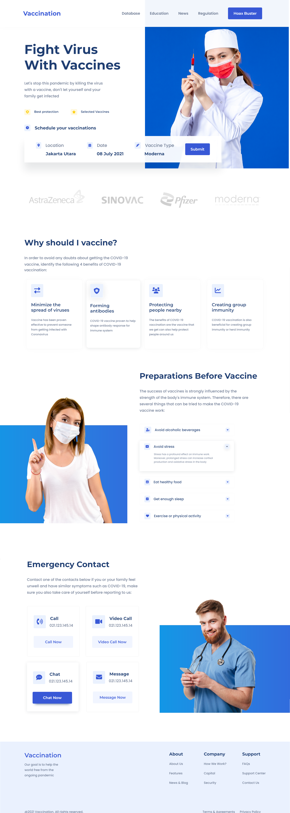

# Prácticas de JS
**Katas correspondientes a la semana 3 del curso de FrontEnd de Launch X - Innovaccion Virtual**

Para la práctica de esta semana, clonaremos la página siguiente: [Website](./docs/web-design.png) by [Adhiari Subekti](https://dribbble.com/Adhiari_is)

La práctica consiste en lo siguiente:

- [Planeación de campaña de vacunación](./docs/Marketing_Plan.png) (Un poco de mercadotecnia para llegar al sitio)
- [Maquetación del sitio con HTML](./index.html)
- [Estilos](./assets/css/custom.css) con CSS (Lo más acercado posible, pueden ser otras imágenes, íconos o colores, pero tiene que ser lo más cercano que puedas)

### Resultado
Este fue el resultado de la práctica:

---
Typed with ❤️ by [Daniel Campos](https://github.com/giusniyyel) 😊