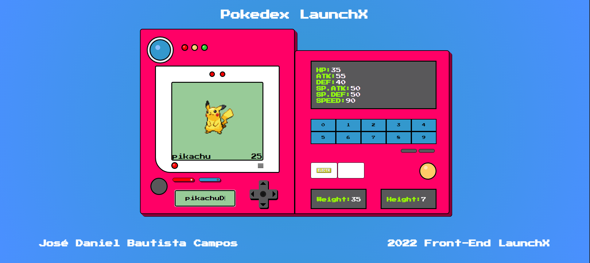

# Prácticas de JS
**Katas correspondientes a la semana 4 del curso de FrontEnd de Launch X - Innovaccion Virtual**

Para la práctica de esta semana, realizaremos una Pokedex.

La práctica consiste en lo siguiente:

- [Maquetación del sitio con HTML](./pokedex.html)
- [Diseño con CSS para que parezca un pokedex la página](./assets/css/pokedex.css)
- Tener un input de entrada, donde se meta el nombre del pokemón a buscar.
- Tomar ese input e ir a [consultar](./assets/js/pokedex.js) el API de [pokeapi](https://pokeapi.co/)
- Mostrar en pantalla los siguientes datos del pokemón ingresado:
    - Nombre
    - Imágen
    - Tipo de pokemón
    - Estadísticas

### Resultado
Este fue el resultado de la práctica:

---
Typed with ❤️ by [Daniel Campos](https://github.com/giusniyyel) 😊